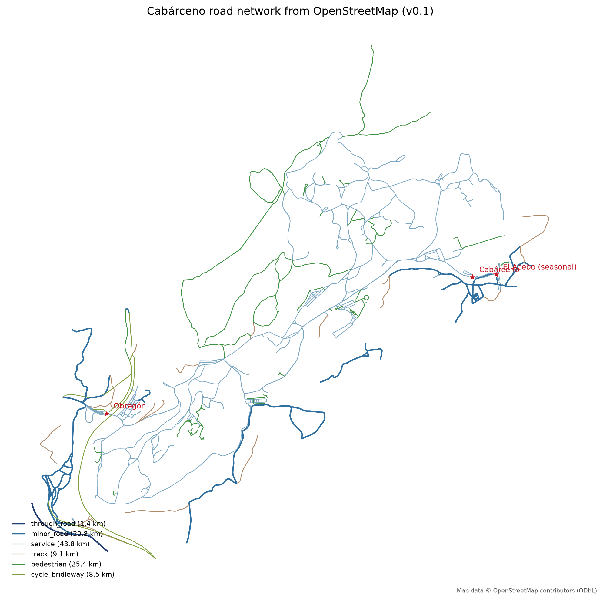
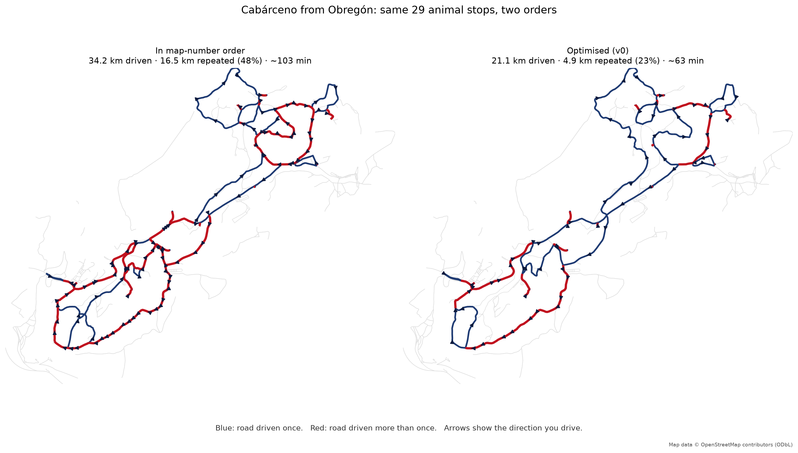

> **Status: working prototype, built for my own use.** Everything below is
> reproducible from a repo, but the dwell times are assumptions, some of the park is
> missing from OpenStreetMap, and none of it has been driven yet. Read
> [What I should not trust](#what-i-should-not-trust) before relying on it.

## The short version

Cabárceno is about 17 km of road wound around a former open-cast mine, and you see it
from the car. There is a numbered list of animals on the visitor map, and working down
that list means driving **34.2 km** with **48% of it on roads you have
already driven**.

Ordering the same stops properly gets it to **21.1 km**, with repeated road down to
**23%**. Same 29 animal areas, about **13.1 km and 39 min less
driving**.

| From | Driven | Repeated road | At the wheel |
| --- | ---: | ---: | ---: |
| Obregón | 21.1 km | 4.9 km (23%) | 1h03 |
| Cabárceno | 21.0 km | 5.0 km (24%) | 1h03 |
| El Acebo *(seasonal)* | 21.4 km | 5.1 km (24%) | 1h04 |

Add a five-minute stop at each enclosure and the whole circuit from Obregón comes to
roughly **4h03** door to door.

## Use it in the park

Open one of these on your phone. Each has a folded-up panel in the corner and a
**locate button** in the top-left.

### From Obregón (the main, north entrance)

<p style="margin:1.2rem 0 .4rem"><a href="/cabarceno/route-obregon.html" target="_blank" rel="noopener" style="display:inline-block;padding:.55rem 1rem;border-radius:8px;background:#1f3b73;color:#fff;text-decoration:none;font-weight:600">↗ Open the Obregón route full screen</a></p>
<iframe src="/cabarceno/route-obregon.html" allow="geolocation" loading="lazy" title="Interactive Cabárceno map" style="width:100%;height:560px;border:1px solid #d8d8d8;border-radius:10px;margin:.4rem 0 1rem"></iframe>

- **Plan** — every stop with a running clock, so you can see where you will be at 13:00.
- **Detours** — each turning you could skip, priced as a round trip back to the same
  junction. "Watusi, +5 min. Skip it and carry on to Hipopótamo Pigmeo."
- **Stops** — toilets, restaurants, playgrounds and the cable car, with where to break
  off and what it costs.
- **⊙ button** — shows where you are, with an accuracy ring, and follows you until you
  drag the map.

On a phone the panel starts folded so the map fills the screen; tap its header to open
it.

Other entrances: [**Pueblo de Cabárceno**](/cabarceno/route-cabarceno.html) ·
[**Lago El Acebo**](/cabarceno/route-acebo.html) — El Acebo is a seasonal entrance,
**check it is open before driving there**.

> **Signal.** The map tiles come from OpenStreetMap's servers over the network. Open
> each map once on wifi before setting off and leave the tab open; a cold load with no
> signal gives you the route and the plan on a blank background.

### The decisions the map prices for you

These are the turnings on the Obregón route where carrying straight on costs you a
named animal and saves a known amount of time:

| At | You would see | Round trip |
| --- | --- | ---: |
| after **Obregón** | León Marino y Reptilario | +5 min |
| after **León Marino y Reptilario** | Gorila de Llanura y Mono de Brazza | +6 min |
| after **Gaur** | Hipopótamo Anfibio | +5 min |
| after **Asno Somalí** | Oso Pardo | +6 min |
| after **Papión de Guinea** | Bisonte Europeo | +5 min |
| after **Bisonte Europeo** | León Africano | +7 min |
| after **Cobo de Agua** | 4 stops: Guepardo, Lobo Ibérico, Addax y Búfalo Cafre, Oryx del Cabo | +27 min |
| after **Cobo de Agua** | 6 stops: Guepardo, Lobo Ibérico, Addax y Búfalo Cafre, Oryx del Cabo, Cebra Grevy, Watusi | +40 min |
| after **Cebra Grevy** | Watusi | +5 min |
| after **Watusi** | Elefante Africano, Búfalo de Agua y Cobo de Lechwe | +6 min |

The two big ones matter: that **+40 min** branch is most of the western loop.
If the day is going badly, that is the single decision that buys back the most time.

## How the route was derived

```
OpenStreetMap  →  drive graph  →  viewpoints  →  distance matrix  →  OR-Tools  →  back onto real roads
```

**The road network** comes from OpenStreetMap, extracted for the park's own boundary
relation: 453 junctions, 862 drivable segments, 77 km of road. Each
segment carries an explicit decision about whether a visitor may drive it and *why* —
"access=private" excludes, "motor_vehicle=yes" includes — so any road in or out of the
route has an answer attached.



**The animals** come from the official March 2026 visitor map — names and numbers only,
which are facts, not cartography. 30 of the 33 numbered entries were
matched by hand to an OpenStreetMap feature.

**The viewing points** are derived, never invented: for each enclosure polygon, the
closest point on the nearest drivable road, with the road split there so it becomes a
real stop. 34 of 36 are within 35 m of tarmac, which fits a park where
you are asked to stay in the car.

**The ordering** is a travelling-salesman problem solved with OR-Tools — over
*road-network* distances from Dijkstra, never straight lines. That distinction is not
pedantic here: two paddocks 200 m apart across a fence can be 3 km apart by road, and
some park roads are one-way, so the worst A→B versus B→A pair in this data differs by
nearly 4 km.

**Then the honest part.** A tour that looks perfect on a distance matrix can still send
you down the same lane four times, because the matrix hides which roads each leg uses.
So every route is expanded back onto real OpenStreetMap edges and measured:

```
repeated metres = Σ max(0, times driven − 1) × segment length
```



Red is road driven more than once. Same park, same animals, two orders. Almost all of
the extra 13.1 km is that red.

[See the two side by side, interactively](/cabarceno/compare-obregon.html) ·
[the naive map-number route on its own](/cabarceno/map-number-order-obregon.html) ·
[the raw OSM audit map](/cabarceno/osm-audit.html)

## What I should not trust

**The times are assumptions.** Distances are solid — they are OpenStreetMap geometry.
Driving times are distance ÷ speed, capped at the park's own 30 km/h. But **every dwell
time is a guess**: five minutes per enclosure, forty for a meal, seven for a toilet.
Five minutes × 29 enclosures is 3h00 of the ~4h03 day, so that
one made-up constant dominates the answer. If we really spend three minutes at the cows
and twenty at the elephants, the whole plan shifts.

**It is not the official recommended route, and I cannot say I beat it.** The park does
draw a recommended itinerary — but as a *line on the map artwork*, not as the 1→33
numbering, which is only a legend index. Tracing that line would mean copying
copyrighted cartography, so the comparison above is against visiting in map-number
order. That is a fair stand-in for an unplanned visit, and it is the only claim made.

**Three things on the official list are missing:** **Dromedario**, **Aula Medioambiental, Sala 360º, Casa Oso Pardo**, **(unlabelled on the 2026-03 map)**. They have no
OpenStreetMap feature to attach to, and I would rather leave them out than invent
coordinates. The route visits 29 of the animal areas, not all of them.

**The road rules come from OpenStreetMap, not from the park.** 655 of the
862 drivable segments were included on weak evidence — service roads, tracks,
or no access tag at all. One-way restrictions may be missing or wrong.
**If a sign contradicts the map, the sign wins.** This route has never been driven.

**Opening hours are not modelled at all**, so the panel can cheerfully suggest a
restaurant that is shut. The birds-of-prey demonstration is in the plan as a fixed
40-minute cost, but the model has no idea when the shows actually are — that needs
time windows, which is the next piece of work.

**Congestion is not modelled.** Twenty cars stopped at the elephants is the normal
state of that road in August and nothing here knows about it.

**It is a heuristic, not a proof.** OR-Tools returns a very good tour, not a guarantee
that none is better. Several tours tie exactly on distance while differing in where
lunch falls — the solver picks one, and that choice is currently arbitrary.

## Tomorrow's checklist

1. Open the Obregón map before leaving; the tiles cache, but do not count on signal.
2. Press ⊙ once in the car park so the browser asks for location while you still have
   patience for it.
3. Check the **birds of prey** show times on arrival — the plan puts it in but does not
   know the timetable.
4. If starting from El Acebo instead, **confirm it is actually open**.
5. Treat the Detours tab as the "we are running late" lever, not the plan.
6. Obey the signs, not me.

## Data, licence, reproducing

Map data © OpenStreetMap contributors, available under the
[ODbL](https://www.openstreetmap.org/copyright). Animal names and numbering are facts
taken from the park's own March 2026 visitor map; no cartography was copied, and no
coordinate here came from a proprietary source.

OSM snapshot `2026-08-09T23:11:30+00:00`, extracted with OSMnx 2.1.1. The whole pipeline —
extraction, graph derivation, matching, solving, these maps and this post — regenerates
from scripts.

*Next: let each enclosure be satisfied by any of its viewpoints instead of one fixed
point; time windows for the show and for lunch; and best-value routes for a two- or
three-hour visit rather than the full circuit.*
